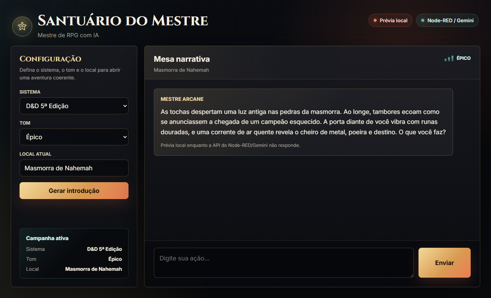

# Santuário do Mestre - Agente de RPG com IA

## Sobre o Projeto

O **Santuário do Mestre** é um agente inteligente desenvolvido em **Node-RED** com integração à API do **Google Gemini**.

O sistema atua como um **Mestre de RPG virtual**, capaz de criar cenários, narrar aventuras e responder às ações dos jogadores em tempo real utilizando Inteligência Artificial Generativa.

O usuário pode definir o sistema de RPG, o tom da narrativa e o local da aventura. A IA utiliza essas informações para gerar automaticamente uma introdução personalizada e conduzir a história de forma dinâmica.

Este projeto foi desenvolvido para a disciplina de **Engenharia de Prompt e Agentes de Automação**, demonstrando a criação de agentes inteligentes utilizando fluxos automatizados e modelos de linguagem.

---

# Prévia do Design



---

# Funcionalidades

* Interface web temática de RPG
* Layout responsivo para desktop e mobile
* Prévia local quando a API ainda não estiver ativa
* Integração com Google Gemini
* Geração automática de cenários
* Geração dinâmica de narrativas
* Mestre de RPG baseado em IA
* Configuração de sistema de RPG
* Configuração do tom da aventura
* Configuração livre do cenário
* Comunicação via API REST
* Fluxos desenvolvidos em Node-RED
* Atualização automática da introdução
* Respostas em tempo real

---

# Tecnologias Utilizadas

* Node-RED
* Google Gemini API
* HTML5
* CSS3
* JavaScript
* JSON
* REST API

---

# Como Funciona

Ao acessar a aplicação, o usuário escolhe:

* Sistema de RPG
* Tom da narrativa
* Local da aventura

Exemplo:

```text
Sistema: D&D 5e
Tom: Sombrio
Local: Castelo abandonado nas montanhas
```

O sistema envia essas informações para a IA, que gera automaticamente uma introdução exclusiva para a aventura.

Posteriormente, o jogador pode realizar ações como:

```text
Abro a porta lentamente.
```

ou

```text
Investigo as pegadas no chão.
```

A IA interpreta a ação e continua a narrativa respeitando o cenário configurado.

---

# Arquitetura

```text
Usuário
   │
   ▼
Interface Web (/rpg)
   │
   ├── Gerar Introdução
   │
   └── Enviar Ação
           │
           ▼
       Node-RED
           │
           ├── Engenharia de Prompt
           │
           ├── Google Gemini
           │
           └── Processamento da Resposta
                   │
                   ▼
             Narrativa Gerada
```

---

# Fluxos do Node-RED

## Interface Web

```text
GET /rpg
    ↓
Template (HTML)
    ↓
HTTP Response
```

---

## Geração de Introdução

```text
POST /api/introducao
    ↓
Montar Prompt Introdução
    ↓
HTTP Request (Gemini)
    ↓
Interpretar Introdução
    ↓
HTTP Response
```

Este fluxo gera automaticamente o cenário inicial da aventura com base nas configurações escolhidas pelo usuário.

---

## Continuação da Narrativa

```text
POST /api/rpg
    ↓
Montar Prompt RPG
    ↓
HTTP Request (Gemini)
    ↓
Interpretar Resposta IA
    ↓
HTTP Response
```

Este fluxo recebe as ações do jogador e produz a continuação da história.

---

# Instalação

## 1. Instalar o Node-RED

```bash
npm install -g --unsafe-perm node-red
```

Executar:

```bash
node-red
```

---

## 2. Importar o Fluxo

No Node-RED:

```text
Menu
→ Import
→ Selecionar flow.json
→ Deploy
```

---

## 3. Criar uma Chave da API Gemini

Acesse:

https://aistudio.google.com/app/apikey

Crie uma chave gratuita da API Gemini.

---

## 4. Configurar a Chave da API

Localize os nós responsáveis pela construção dos prompts.

Você encontrará algo semelhante a:

```javascript
const API_KEY = "SUA_CHAVE_AQUI";
```

Substitua pelo valor da sua chave.

Exemplo:

```javascript
const API_KEY = "AIza...";
```

Recomenda-se utilizar variáveis globais do Node-RED:

```javascript
const API_KEY = global.get("GEMINI_API_KEY");
```

Assim a chave não fica exposta no código.

---

## 5. Executar o Projeto

Após realizar o deploy, acesse:

```text
http://localhost:1880/rpg
```

---

# Exemplo de Uso

## Configuração

```text
Sistema: Tormenta20
Tom: Épico
Local: Fortaleza dos Dragões de Cristal
```

## Introdução Gerada

```text
O brilho dos cristais azuis ilumina os corredores da antiga fortaleza.
O vento gelado atravessa as muralhas enquanto um rugido distante ecoa pelos céus.
Guardas parecem inquietos diante de uma ameaça desconhecida.
O que você faz?
```

## Ação do Jogador

```text
Investigo o rugido.
```

## Resposta da IA

```text
Você sobe rapidamente até uma das torres mais altas.
Ao alcançar o topo, percebe uma enorme silhueta cruzando as nuvens.
As asas cristalinas refletem a luz do sol como milhares de espelhos.
A criatura parece estar se aproximando da fortaleza.
```

---

# Estrutura do Projeto

```text
.
├── docs/
│   └── design-preview.png
├── flows.json
├── formulario.html
├── README.md
└── .flows.json.backup
```

O arquivo `formulario.html` é a versão editável da interface. O mesmo HTML está sincronizado dentro do nó `Interface RPG` em `flows.json`, que é o fluxo importado no Node-RED.

---

# Objetivo Acadêmico

O projeto demonstra a aplicação prática dos conceitos de:

* Agentes Inteligentes
* Engenharia de Prompt
* Automação de Processos
* Integração com APIs
* Inteligência Artificial Generativa
* Desenvolvimento Low-Code
* Sistemas Baseados em Eventos

---

# Autores

Vitor Camillo

Maurício Tolosa

Projeto desenvolvido para a disciplina de Engenharia de Prompt utilizando Agentes de Automação, Node-RED e Google Gemini.
